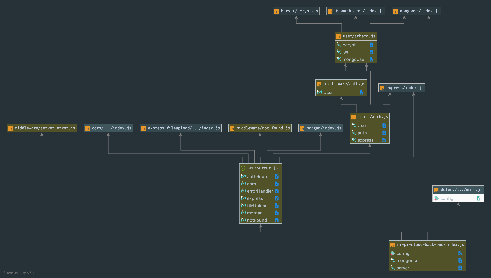

# Mi-Pi-Cloud

 ## Server

 ### Author: Evan Brecht-Curry

 ### Links and Resources
* [submission PR](https://github.com/evan-401-advanced-javascript/mi-pi-cloud-back-end/pull/3)
* [travis](https://www.travis-ci.com/evan-401-advanced-javascript/mi-pi-cloud-back-end)
* [netlify](https://inspiring-hopper-8e7453.netlify.com) 
* [docs]( http://localhost:6060/)

 ##### Exported Values and Methods

### Setup
* `npm install --save-dev react-styleguidist`
* `npx styleguidist server`

#### `.env` requirements
`PORT=8080`
`MONGODB_URI=mongodb://localhost:27017/db`
`SECRET=secret`

 #### UML
